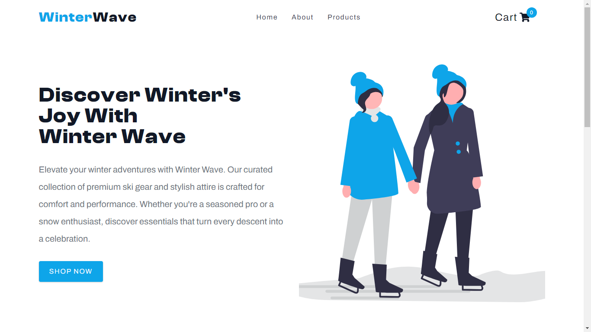
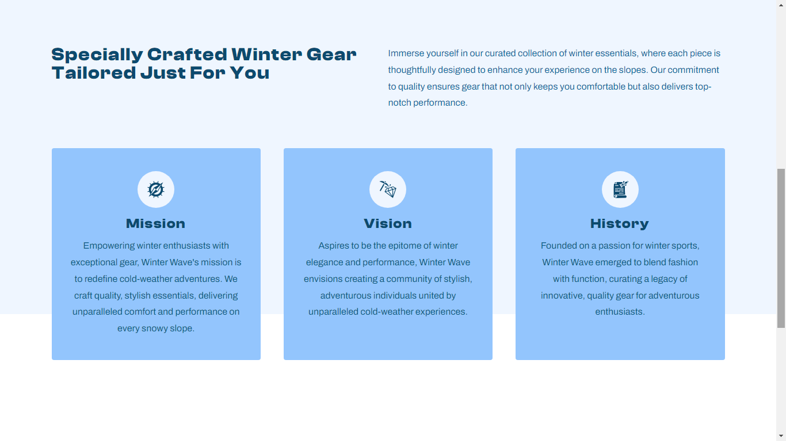
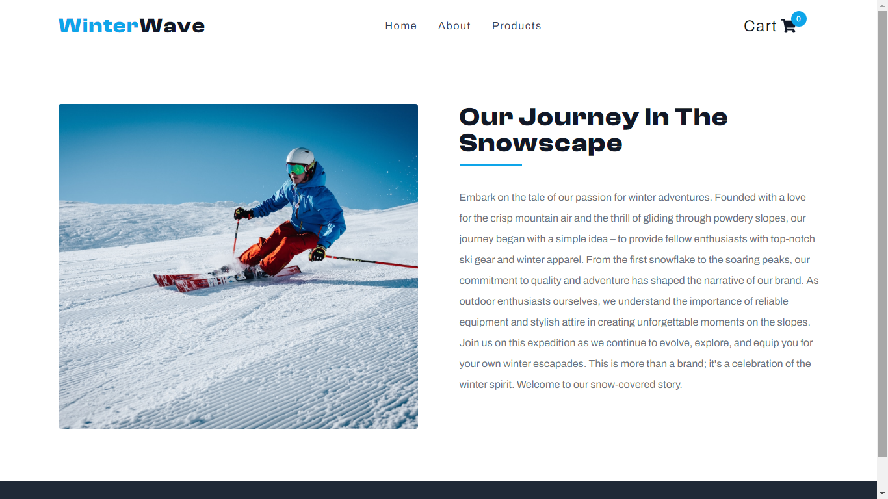
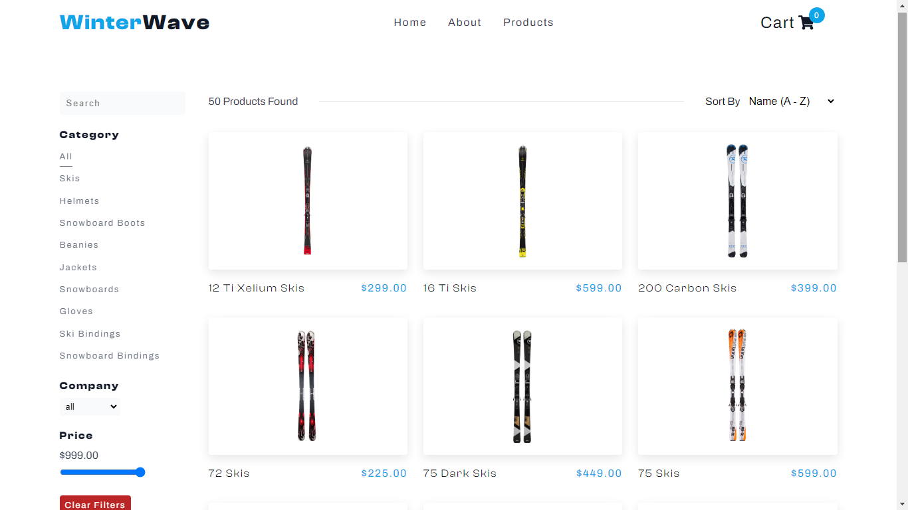
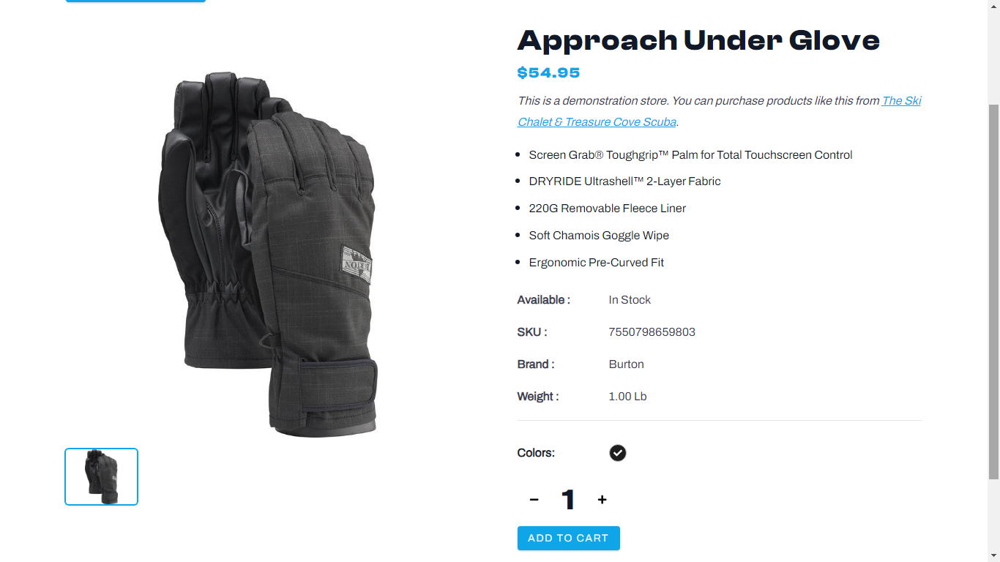
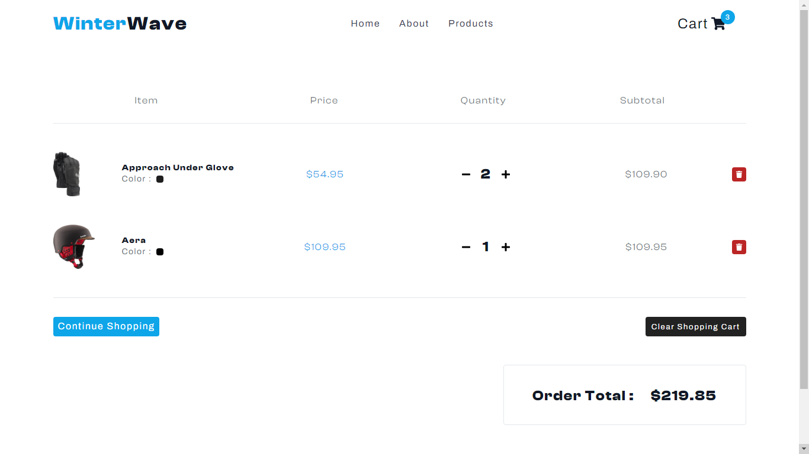

# Winter Wave E-commerce App

Welcome to Winter Wave, a stylish e-commerce app for premium winter gear and attire.

## Table of Contents

- [Demo](#demo)
- [Screenshots](#screenshots)
- [Features](#features)
- [Installation](#installation)
- [Usage](#usage)
- [Netlify Functions](#netlify-functions)
- [Testing](#testing)
- [Contributing](#contributing)
- [License](#license)

## Demo

[Live Demo](https://winter-wave.netlify.app/)

## Screenshots








## Features

### Browse and Add Products to Cart

Explore our premium winter clothing and equipment collection, review product details, and easily add items to your shopping cart.

---

### Comprehensive Product Catalog

Navigate through a diverse range of winter products, accessing different categories and brands with ease.

---

### Subscribe to Email Newsletter

Stay updated with exclusive offers and the latest updates by subscribing to our email newsletter.

---

### Enhanced User Experience

Enjoy a user-friendly interface and intuitive design that simplifies the shopping experience.

---

### Mobile Responsive Design

Experience seamless shopping on the go with our fully responsive design optimized for mobile devices.

---

### Search and Filtering Options

Effortlessly find products using our search functionality and apply filters to narrow down your choices.

---

These features are designed to provide users with a rich and convenient shopping experience, making Winter Wave the ideal destination for premium winter gear and attire.

## Installation

1. Clone the repository.

   ```bash
   git clone https://github.com/MrEmin/444ab817c443ac989a845af2a0caf6f8`

   ```

2. Change to the project directory.

   bashCopy code

   `cd 444ab817c443ac989a845af2a0caf6f8`

3. Install dependencies.

   bashCopy code

   `npm install`

## Usage

Create a `.env` file in the project root and add the following:

dotenvCopy code

`API_URL=https://your-api-url.com &
ACCESS_TOKEN=your-access-token`

Replace `https://your-api-url.com` and `your-access-token` with your actual API URL and access token.

2.  Run the development server.

    bashCopy code

    `npm start`

3.  Open your browser and visit `http://localhost:3000` to view the app.

## Netlify Functions

This project uses Netlify Functions for serverless backend operations. The Netlify configuration is specified in the `netlify.toml` file. Here is the content of the `netlify.toml` file:
`[build] functions = "./functions"`

## Testing

Run tests using the following command:

bashCopy code

`npm test`

## Contributing

Contributions are welcome! Please fork the repository and create a pull request.

## License

This project is licensed under the MIT License.
